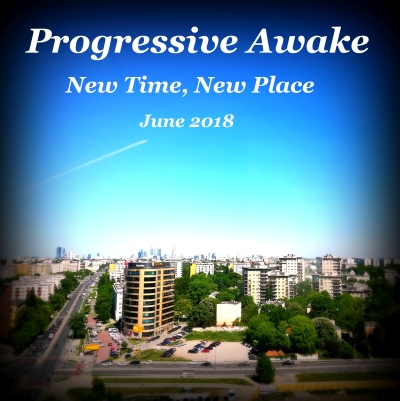

# New Time, New Place (June 2018)

----

Date: 2018-06-19  
Tags: *#deep* *#progressive* *#melodic* *#house* *#techno*    
  
  

[**DOWNLOAD (148MB, 1h 4min)**](https://docs.google.com/uc?id=11uRygrA-NGSJDh6bdVd1Z3hVG39rS7dh&export=download) 
or 
[**LISTEN @ MIXCLOUD**](https://www.mixcloud.com/progressiveawake/new-time-new-place-june-2018/)  

**Tracklist:**  
 
01. ArtLec - White Bay (Original Club Mix)
02. COMA - Lora (Robag's Fandara Qualv NB)
03. Mikele ft. Michaela - My feelings
04. Marc Romboy, Stephan Bodzin - Atlas (Adriatique Remix)
05. Joachim Pastor - Reykjavik (Original Mix)
06. The Knocks, Sam Nelson Harris - HEAT (feat. Sam Nelson Harris) (Toyboy & Robin Remix)
07. Robert R. Hardy - Sensus (Original Mix)
08. Music Brothers - Seratonina (Original)
09. Mauro Picotto, Riccardo Ferri - New Time New Place (Egbert Remix)
10. Edu Imbernon, Droog (LA) - Gamut (Original Mix)
11. Rodriguez Jr. - Lila (Original Mix)
12. Pysh - Pineapplejam (Not Mastered)
13. Joris Delacroix - Air France (Original Mix)
14. Solee - Phoenix (Unique Repeat Remix)
 
Enjoy & support artists by buying their music or by listening using 
[Spotify](https://open.spotify.com/user/hopbit/playlist/2t2d8XXigBzIN9VVOZUTm6?si=Xq1rzbIOSISla_sx27XGnQ).

----

[BACK TO MAIN PAGE**](../README.md)

---- 